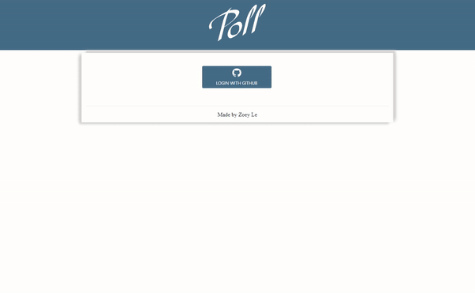
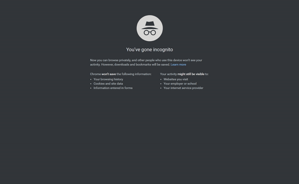

# Voting App 

---------------------
Live website: https://poll-zle.herokuapp.com/
---------------------

## Overview
This is a fullstack web application utilizing MongoDB, Express and Node with [Passport.js](http://passportjs.org/) for authentication. It lets user create/delete polls, share to get voting count and show the user its aggregate results with pie chart visualization (Chart.js).

It was built upon [Clementine.js boilerplate](http://www.clementinejs.com/). For simplication purposes, only client's Github account is used as an authentication account of this page.

## User stories:
* As an authenticated user, I can keep my polls and come back later to access them.
* As an authenticated user, I can share my polls with my friends.
* As an authenticated user, I can see the aggregate results of my polls.
* As an authenticated user, I can delete polls that I decide I don't want anymore.
* As an authenticated user, I can create a poll with any number of possible items.
* As an unauthenticated or authenticated user, I can see and vote on everyone's polls.
* As an unauthenticated or authenticated user, I can see the results of polls in chart form. (This could be implemented using Chart.js or Google Charts.)
* As an authenticated user, if I don't like the options on a poll, I can create a new option.

## Quick Demo

Signing in with a github account, the user can create, delete, and share polls. The user has 2 choices: new poll and my poll. New poll page lets the user create new poll. My poll page lets the user manage their polls and see polls' aggregate results.

    

Anyone can vote then see the poll's result by following the share link without authentication. This following demo proves that by using incognito mode on Chrome.

    

## Utilization
| Name          | Use           |  
| ------------- |:-------------:|
| Bootstrap     | Advocates designing the template of pages |
| AJAX          | Communicates between front and back end | 
| Chart.js      | Visualizes voting data with multiple colors      |  
| Express       | Creates backend framework and logic    |
| Mongoose      | Provides easier way to work with MongoDB |
| Passport      | Provides simple authentication in Node.js |

### Note
* The logo was an original design using Adobe Photoshop.
* The live website can be shutdown when traffic is high due to the free tier version of Heroku server.

-------------------
ヾ(｡･ω･｡)
